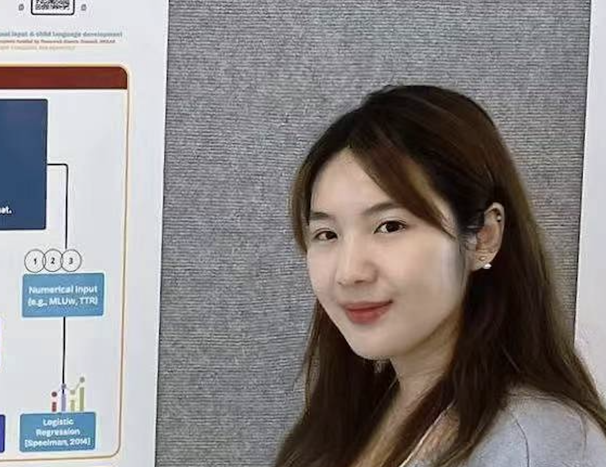

# About me

Hi, I'm Yue Chen (陈玥 [ʈʂʰən35 ɥœ51]). I am a PhD student in Linguistics at the University of Southern California (USC) advised by Prof. [Elsi Kaiser](https://elsikaiser.com/). I am affiliated with the [Psycholinguistics of Mono- and Multilingualism Lab (PoMMLab)](https://www.zuzannazfuchs.com/pommlab.html) at USC led by Prof. [Zuzanna Fuchs](https://www.zuzannazfuchs.com/).

Before joining USC, I completed my Bachelor of Arts degree in Linguistics and Psychology at the University of California, Los Angeles (UCLA), and served as a Research Assistant at [the Language and Cognition Development (LCD) Lab](https://babytalk.psych.ucla.edu/), [Language Processing Lab](https://processing.linguistics.ucla.edu/) and the [UCLA Language Acquisition Lab](https://languagelab.humanities.ucla.edu/en/). Following my graduation, I held a position as a Junior Research Assistant under the supervision of Prof. [Maggie Ziyin Mai](https://maiziyin.com/) at the Chinese University of Hong Kong (CUHK).

My primary interests lie in language acquisition, language processing, and theoretical semantics. I utilize experimental, computational, and corpus methodologies to explore fundamental questions about how both children and adults process, acquire, and comprehend language meaningfully.

## Academic Background

- **University of Southern California**
  - PhD in Linguistics, 2024 - Present
- **The University of California, Los Angeles (UCLA)**
  - BA in Linguistics and Psychology, 2023
  - Minor in Comparative Literature, 2023

---
## Summer School

- **/L+/ International Summer / Winter School on Language Acquisition**
  - University of Potsdam, Online, 2023
- **The North American Summer School for Logic, Language and Information (NASSLLI '25)**
  - University of Washington, Seattle, Online, 2025

---
## Research Interests

- Language Acquisition
- Language Processing
- Heritage Language
- Semantics

---
## Skills

- **Programming**: C/C++, Python (NumPy, PyTorch, Transformers), MATLAB, R
- **Software and Tools**: LaTeX, CLAN, ELAN, Praat, PCIbex, SPSS, Qualtrics, SynthWorks, Rezonator
- **Languages**: Wu Chinese (native), English and Mandarin Chinese (fluent), Spanish and Cantonese (basic)
